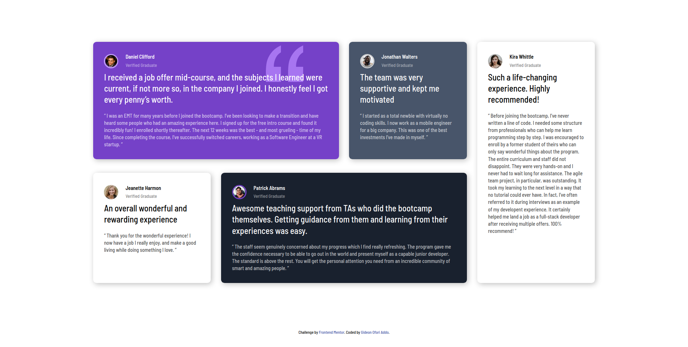

# Testimonial-Grid-Section
Testimonial Grid Section

# Frontend Mentor - Testimonials grid section solution

This is a solution to the [Testimonials grid section challenge on Frontend Mentor](https://www.frontendmentor.io/challenges/testimonials-grid-section-Nnw6J7Un7). Frontend Mentor challenges help you improve your coding skills by building realistic projects. 

## Table of contents

- [Overview](#overview)
  - [The challenge](#the-challenge)
  - [Screenshot](#screenshot)
  - [Links](#links)
- [My process](#my-process)
  - [Built with](#built-with)
  - [What I learned](#what-i-learned)
  - [Continued development](#continued-development)
- [Author](#author)
- [Acknowledgments](#acknowledgments)

## Overview

Testimonial Grid Section

### The challenge

Users should be able to:

- View the optimal layout for the site depending on their device's screen size

### Screenshot

### Links

- Solution URL: [Add solution URL here](https://github.com/wuzgood98/Testimonial-Grid-Section/)
- Live Site URL: [Add live site URL here](https://wuzgood98.github.io/Testimonial-Grid-Section/)

### Built with

- Semantic HTML5 markup
- CSS custom properties
- Flexbox
- CSS Grid

### What I learned

- CSS Grid
Had little knowledge about CSS Grid but this challenge has helped me improve on my skills on layout out a webpage.

### Continued development

- CSS Grid
- CSS Media Queries

## Author

- Frontend Mentor - [@wuzgood98](https://www.frontendmentor.io/profile/wuzgood98)
- Twitter - [@wuz_goood](https://www.twitter.com/wuz_goood)
- Github - [@wuzgood98](https://github.com/wuzgood98)

## Acknowledgments

I had a little problem with using CSS Grid to layout the contents of the page but with the help of [TraversyMedia](https://www.youtube.com/c/TraversyMedia/) I was able to complete the challenge.